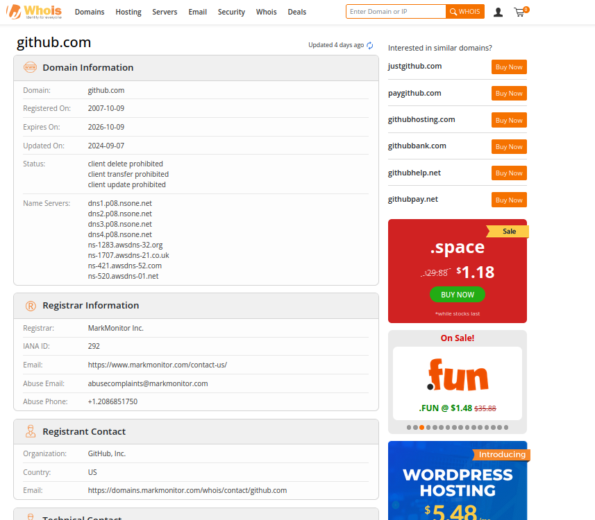
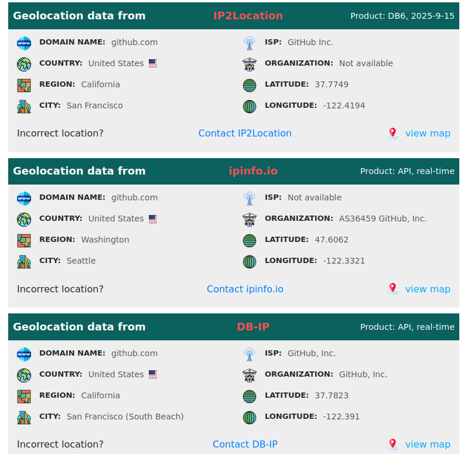
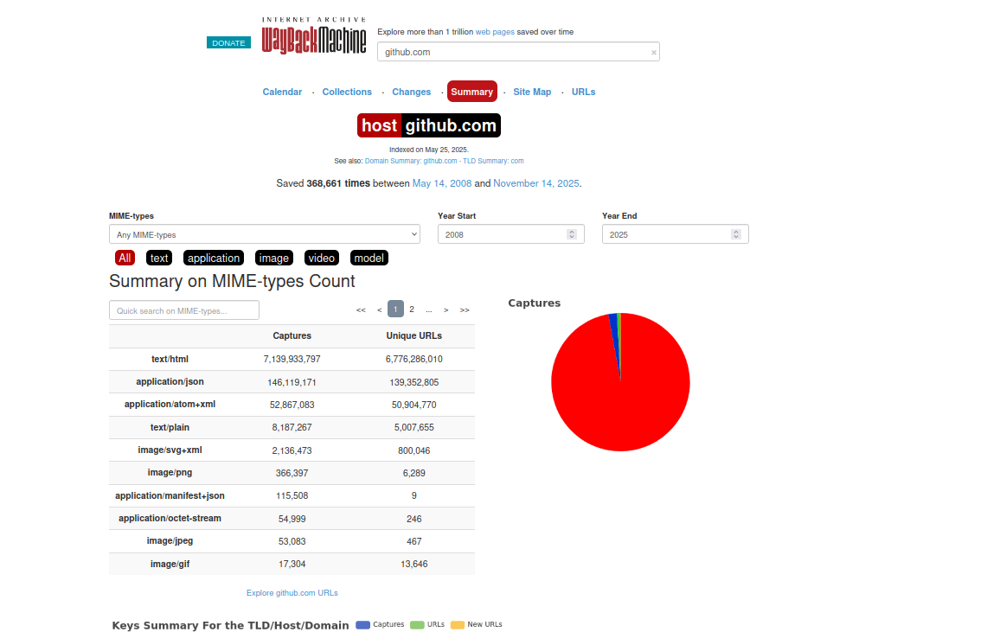
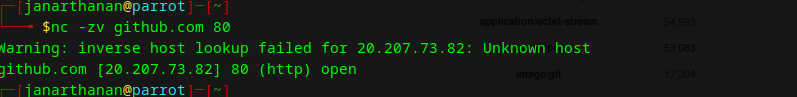
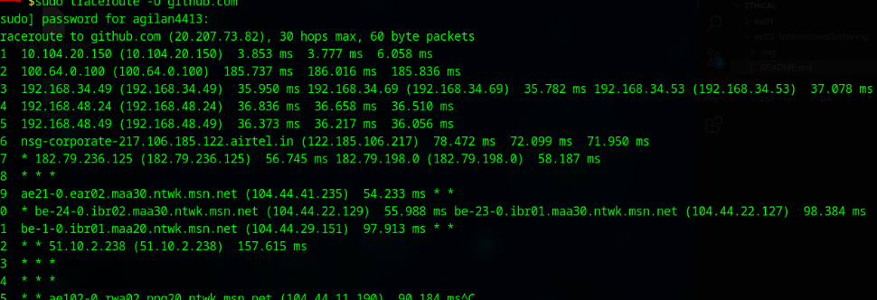

# InformationGathering
Information Gathering Techiques

# To perform information gathering techniques

# AIM:

To perform information gathering techniques using kali linux 

## STEPS:

### Step 1:

Install kali linux either in partition or virtual box or in live mode

### Step 2:

Investigate on the various categories of tools as follows:

### Step 3:
Open terminal/browser and try execute necessary commands/use url to perform information gathering

## OUTPUT:

### whois.com :

### iplocator :

### webarchive :

### nmap :

### whatweb :

### traceroute :

### ping :

### netcat :

### UDP traceroute :

### ICMP traceroute :

## RESULT:
The information gathering techniques tools/procedure were  identified successfully
